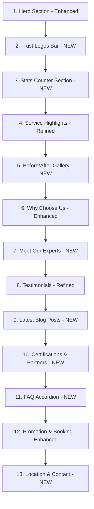

# Quang Dang Clinic Homepage UI/UX Improvement Plan

## Executive Summary

Transform the current homepage into a luxury, trust-building experience that drives bookings through strategic new sections and refined visual design.

---

## Current State Analysis

### Existing Sections
1. **Hero** - Full-screen with CTA (good foundation)
2. **Trust Badges** - 4 stats (Top 10, Y Khoa, Công nghệ, Khách hàng)
3. **Service Highlights** - 4 featured services grid
4. **Why Us** - Value proposition with image
5. **Testimonials** - Customer reviews (3 cards)
6. **Promotion & Booking** - 50% off CTA + booking form

### Current Pain Points
- Needs more trust signals for luxury positioning
- Visual hierarchy could be more refined
- Missing social proof through real results
- No team visibility to build personal connection
- Blog content not surfaced on homepage

---

## Proposed New Homepage Structure



---

## Detailed Section Specifications

### 1. Hero Section (Enhanced)
**Purpose:** First impression, immediate value proposition

**Improvements:**
- Add subtle parallax scroll effect on background
- Implement text reveal animation with stagger
- Add floating trust badges ("10,000+ khách hàng tin tưởng")
- Include quick stats overlay (years of experience, awards)
- Add scroll indicator with bounce animation

**Design Notes:**
- Keep current green (#0D7351) as primary
- Add gold accent (#D4AF37) for luxury feel
- Typography: Keep Cormorant for headings, refine hierarchy

---

### 2. Trust Logos Bar (NEW)
**Purpose:** Immediate credibility through certifications

**Content:**
- FDA Approved badge
- ISO 9001 certification
- Ministry of Health license
- Equipment brand logos (Germany Laser, etc.)

**Design:**
- Horizontal scrolling marquee on mobile
- Grayscale logos that colorize on hover
- Subtle background: `bg-nude-100/50`

---

### 3. Stats Counter Section (NEW)
**Purpose:** Quantify trust with animated statistics

**Stats to Display:**
| Stat | Value | Label |
|------|-------|-------|
| Happy Customers | 10,000+ | Khách hàng hài lòng |
| Years Experience | 15+ | Năm kinh nghiệm |
| Treatments | 50,000+ | Liệu trình thực hiện |
| Expert Team | 20+ | Chuyên gia bác sĩ |

**Design:**
- Large numbers with AnimatedCounter component
- Icons above each stat
- Grid layout: 2x2 on mobile, 4 columns on desktop
- Background: White with subtle gradient

---

### 4. Service Highlights (Refined)
**Purpose:** Showcase key services

**Improvements:**
- Add category filter tabs (Da liễu, Thẩm mỹ, Giảm béo)
- Implement horizontal scroll on mobile
- Add "View All Services" CTA
- Enhance hover effects with image zoom + overlay slide-up

---

### 5. Before/After Gallery (NEW)
**Purpose:** Visual proof of treatment results

**Features:**
- Interactive slider comparison (drag to reveal)
- Filter by treatment type
- Lightbox for full-screen view
- Caption with treatment details

**Placeholder Content:**
- 6 treatment categories with placeholder images
- Categories: Trị mụn, Trẻ hóa, Triệt lông, Tắm trắng, Filler, Giảm béo

**Design:**
- Clean white cards with subtle shadow
- Green accent border on hover
- "Kết quả thực tế" badge

---

### 6. Why Choose Us (Enhanced)
**Purpose:** Differentiate from competitors

**Improvements:**
- Add icons to each reason
- Include supporting imagery
- Add "Our Process" timeline visualization
- Include video thumbnail with play button

**Process Timeline:**
1. Tư vấn miễn phí
2. Soi da chuyên sâu
3. Lập phác đồ điều trị
4. Thực hiện liệu trình
5. Chăm sóc sau điều trị

---

### 7. Meet Our Experts (NEW)
**Purpose:** Build personal connection and trust

**Content for 3-4 Doctors:**
- Professional photo
- Name & title
- Specialization
- Years of experience
- Brief bio (2-3 lines)
- Certifications

**Design:**
- Card-based layout with hover lift effect
- Photo with soft circular frame
- Elegant typography hierarchy
- "Đặt lịch tư vấn" button per doctor

---

### 8. Testimonials (Refined)
**Purpose:** Social proof

**Improvements:**
- Add video testimonials support
- Implement carousel/slider for more reviews
- Add star rating visualization
- Include treatment type tag
- Add customer photo (with permission)

---

### 9. Latest Blog Posts (NEW)
**Purpose:** Content marketing, SEO, education

**Content:**
- Display 3 latest posts from `/tin-tuc`
- Card layout with featured image
- Title, excerpt, date, read time
- "Xem tất cả" link to blog

**Design:**
- Grid: 1 column mobile, 3 columns desktop
- Image hover zoom effect
- Category tag badge

---

### 10. Certifications & Partners (NEW)
**Purpose:** Reinforce credibility

**Content:**
- Equipment partner logos (Germany, USA, Korea)
- Certification badges
- Awards and recognitions

**Design:**
- Logo grid with consistent sizing
- Hover tooltip with description
- Subtle background pattern

---

### 11. FAQ Accordion (NEW)
**Purpose:** Address common concerns, reduce friction

**Questions to Include:**
1. Liệu trình điều trị có đau không?
2. Cần bao nhiêu buổi để có hiệu quả?
3. Có cam kết hiệu quả không?
4. Chi phí điều trị như thế nào?
5. Có chăm sóc sau điều trị không?

**Design:**
- Clean accordion with smooth animation
- Green accent on open state
- Search/filter functionality (optional)

---

### 12. Promotion & Booking (Enhanced)
**Purpose:** Convert visitors to bookings

**Improvements:**
- Add countdown timer for urgency
- Include trust badges ("Bảo mật thông tin", "Tư vấn miễn phí")
- Add alternative contact methods (Zalo, Messenger)
- Include guarantee statement

---

### 13. Location & Contact (NEW)
**Purpose:** Final CTA, provide contact info

**Content:**
- Embedded map
- Address with directions link
- Working hours
- Phone numbers
- Social media links
- Quick contact form (simplified)

**Design:**
- Split layout: Map left, info right
- Sticky contact buttons already exist (keep)

---

## Design System Enhancements

### Color Palette (Luxury Addition)
```css
/* Existing */
--color-green-500: #0D7351;  /* Primary */
--color-nude-50: #FDFCF8;     /* Background */

/* New Luxury Accents */
--color-gold-400: #D4AF37;    /* Gold accent */
--color-gold-500: #C5A028;    /* Gold hover */
--color-cream: #FAF7F2;       /* Premium background */
--color-charcoal: #2C2C2C;    /* Luxury text */
```

### Typography Refinements
- **Headings:** Cormorant (serif) - keep, increase weight contrast
- **Body:** Manrope (sans) - keep, refine line-height
- **New Accent Font:** Add elegant script for special callouts

### Animation Standards
- **Scroll Reveal:** 0.6s duration, ease-out
- **Hover Transitions:** 0.3s duration
- **Stagger Delay:** 100ms between items
- **Page Load:** Hero content stagger 200ms each

### Spacing System
- Section padding: `py-24` (96px) desktop, `py-16` mobile
- Container max-width: `max-w-7xl`
- Card gap: `gap-8` desktop, `gap-6` mobile

---

## Technical Implementation Roadmap

### Phase 1: Foundation & New Components
1. Create reusable section components
2. Enhance existing ScrollReveal with more animations
3. Create Before/After slider component
4. Create TeamMemberCard component
5. Create BlogPostCard component
6. Create FAQAccordion component
7. Create StatsCounter section component

### Phase 2: Section Implementation
1. Implement Trust Logos Bar
2. Implement Stats Counter Section
3. Implement Before/After Gallery
4. Implement Meet Our Experts
5. Implement Latest Blog Posts
6. Implement Certifications & Partners
7. Implement FAQ Accordion
8. Implement Location & Contact

### Phase 3: Enhancements & Polish
1. Enhance Hero with parallax and animations
2. Refine Service Highlights with filters
3. Enhance Why Us with process timeline
4. Refine Testimonials with carousel
5. Enhance Booking section with urgency elements
6. Add gold accent colors throughout
7. Implement luxury hover effects

### Phase 4: Performance & Testing
1. Optimize images (Next.js Image)
2. Implement lazy loading for below-fold sections
3. Test all animations for reduced-motion preference
4. Mobile responsiveness testing
5. Performance audit (Lighthouse)

---

## Component Architecture

### New Components to Create
```
src/components/
├── sections/
│   ├── TrustLogosBar.tsx
│   ├── StatsCounter.tsx
│   ├── BeforeAfterGallery.tsx
│   ├── TeamSection.tsx
│   ├── BlogPreview.tsx
│   ├── Certifications.tsx
│   ├── FAQSection.tsx
│   └── LocationContact.tsx
├── ui/
│   ├── BeforeAfterSlider.tsx
│   ├── TeamMemberCard.tsx
│   ├── BlogPostCard.tsx
│   ├── FAQItem.tsx
│   ├── StatCard.tsx
│   └── LogoMarquee.tsx
└── animations/
    ├── ParallaxImage.tsx
    ├── TextReveal.tsx
    └── CountUp.tsx
```

### Data Structure Additions
```typescript
// types/index.ts additions
interface TeamMember {
  id: string;
  name: string;
  title: string;
  image: string;
  specialization: string;
  experience: string;
  bio: string;
  certifications: string[];
}

interface BeforeAfterCase {
  id: string;
  treatmentType: string;
  beforeImage: string;
  afterImage: string;
  description: string;
  duration: string;
}

interface FAQItem {
  id: string;
  question: string;
  answer: string;
}

interface StatItem {
  id: string;
  value: number;
  suffix: string;
  label: string;
  icon: string;
}
```

---

## Success Metrics

### UX Improvements
- [ ] Increased time on page
- [ ] Reduced bounce rate
- [ ] Higher scroll depth

### Conversion Goals
- [ ] Increased booking form submissions
- [ ] More phone calls from mobile
- [ ] Higher service page click-through

### Technical Performance
- [ ] Lighthouse score > 90
- [ ] First Contentful Paint < 1.5s
- [ ] Time to Interactive < 3s

---

## Implementation Priority

### High Priority (Must Have)
1. Stats Counter Section
2. Before/After Gallery
3. Meet Our Experts
4. FAQ Accordion
5. Location & Contact

### Medium Priority (Should Have)
6. Trust Logos Bar
7. Latest Blog Posts
8. Certifications & Partners

### Low Priority (Nice to Have)
9. Hero parallax enhancements
10. Testimonials carousel
11. Service filter tabs

---

## Notes

- All new sections should be responsive (mobile-first)
- Maintain existing green color scheme as primary
- Gold accents should be used sparingly for luxury feel
- Ensure all images have proper alt text for accessibility
- Implement reduced-motion media query for animations
- Keep booking form prominent and easy to access
